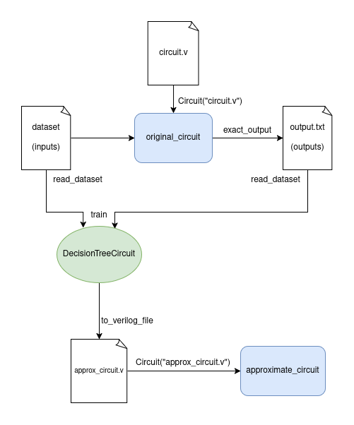

# AxLS

### **An Open-Source Framework for Netlist Transformation Approximate Logic Synthesis**

#### Authors
Jorge Castro-Godínez, professor, Tecnológico de Costa Rica

Humberto Barrantes-García, student, Tecnológico de Costa Rica

Roger Morales-Monge, student, Tecnológico de Costa Rica

## Table of Contents

1. [AxLS](#axls)
2. [Authors](#authors)
3. [Requirements](#requirements)
   1. [Installing Yosys](#installing-yosys)
   2. [Installing Icarus Verilog](#installing-icarus-verilog)
   3. [Cloning benchmarks](#cloning-benchmarks)
4. [Executing Demo](#executing-demo)
5. [Using AxLS](#using-axls)
   1. [Parsing a netlist](#parsing-a-netlist)
   2. [Deleting a node](#deleting-a-node)
   3. [Simulation and Error Estimation](#simulation-and-error-estimation)
6. [ALS Algorithms](#als-algorithms)
   1. [Pruning Algorithms](#pruning-algorithms)
      - [InOuts](#inouts)
      - [Pseudo-Probabilistic Pruning (ProbPrun)](#pseudo-probabilistic-pruning-probprun)
   2. [ML Supervised Learning](#ml-supervised-learning)
      - [Decision Tree (DT)](#decision-tree-dt)
7. [Files and Folders](#files-and-folders)

## Requirements

To use AxLS, Python, Yosys, and Icarus Verilog are required, at least in the
following versions:

| name           | version | -    |
| -------------- | ------- | ---- |
| Icarus Verilog | 10.3    |      |
| Yosys          | 0.9+932 |      |
| Python         | 3.6.8   |      |


### Installing Yosys

```bash
sudo apt-get install build-essential clang bison flex \
	libreadline-dev gawk tcl-dev libffi-dev git \
	graphviz xdot pkg-config python3 libboost-system-dev \
	libboost-python-dev libboost-filesystem-dev zlib1g-dev

git clone https://github.com/cliffordwolf/yosys.git
cd yosys/
make config-clang
make config-gcc
make
make test #optional
sudo make install
```


### Installing Icarus Verilog

```bash
wget ftp://ftp.icarus.com/pub/eda/verilog/v10/verilog-10.3.tar.gz
tar -zxvf verilog-10.3.tar.gz
cd verilog-10.3/
./configure
make
sudo make install
```

### Cloning benchmarks

You'll need to clone the benchmarks from the [ALS-benchmark-circuits](https://github.com/ECASLab/ALS-benchmark-circuits) repo.

```sh
git clone https://github.com/ECASLab/ALS-benchmark-circuits --depth=1
```

## Executing Demo

After cloning the benchmarks and installing the required dependencies you can
execute the `demo.py`.

Note that the demo requires the python `graphviz` package because it renders
images of the circuit graph. You can skip this by modifying the file and setting
the `CREATE_IMAGE` constant to `False.

Example installation with `pip`:
```sh
pip install graphviz
```

Demo execution:
```sh
python demo.py
```

#### Sample output

The demo prints a lot of output, including

- Progress reports of simulations:

```
-- Progress:       99995/100000 --
-- Progress:       99996/100000 --
-- Progress:       99997/100000 --
-- Progress:       99998/100000 --
-- Progress:       99999/100000 --
-- Progress:      100000/100000 --
```

- The circuit's XML:
```
Showing circuit XML
---------------------
b'<root><node name="NAND2_X1" var="_067_"><input name="A1" wire="Y[15]" /><input
/* Skipping most of the output */
<output var="S[16]" /></circuitoutputs><assignments /></root>'
---------------------
Press any key to continue...
```

- The circuit graph representation as an image, including the original circuit and with a node set for deletion.

- Some circuit properties:

```
Circuit inputs...
['X[0]', 'X[1]', 'X[2]', 'X[3]', 'X[4]', 'X[5]', 'X[6]', 'X[7]', 'X[8]', 'X[9]
', 'X[10]', 'X[11]', 'X[12]', 'X[13]', 'X[14]', 'X[15]', 'Y[0]', 'Y[1]', 'Y[2]
', 'Y[3]', 'Y[4]', 'Y[5]', 'Y[6]', 'Y[7]', 'Y[8]', 'Y[9]', 'Y[10]', 'Y[11]', '
Y[12]', 'Y[13]', 'Y[14]', 'Y[15]']
Circuit outputs...
['S[0]', 'S[1]', 'S[2]', 'S[3]', 'S[4]', 'S[5]', 'S[6]', 'S[7]', 'S[8]', 'S[9]
', 'S[10]', 'S[11]', 'S[12]', 'S[13]', 'S[14]', 'S[15]', 'S[16]']
Root of XML tree:  <Element 'root' at 0x724c1a30ab60>
```

- Sample of what the InOuts method would suggest:

```
Nodes to delete if input 0 is constant
['_109_', '_129_']
Nodes to delete if input 3 is constant
['_109_', '_129_', '_108_', '_110_', '_112_', '_111_', '_150_', '_106_', '_107_
', '_113_', '_114_', '_149_', '_115_', '_104_', '_105_', '_116_', '_147_', '_14
8_']
Nodes to delete if output 0 is constant
['_129_']
Nodes to delete if output 5 is constant
['_145_', '_144_']
```

- Sample of what the Pseudo ProbPrun method would suggest:
```
ProbPrun suggest delete the node _068_ because it's 0 75% of the time
_069_ is 0 75% of the time
_070_ is 1 75% of the time
_073_ is 1 75% of the time
_075_ is 0 75% of the time
_076_ is 1 75% of the time
_079_ is 1 75% of the time
_085_ is 1 75% of the time
_086_ is 0 75% of the time
_093_ is 0 75% of the time
_096_ is 1 75% of the time
```

- Final error of approximate circuit:
```
Mean Error Distance of approximate circuit with node _101_ deleted: 3.979
```

## Using AxLS

### Parsing a netlist

1. First, import the `Circuit` class:

```python
from circuit import Circuit
```

2. Some constants are required to define files and their corresponding path:

```python
# verilog file of the circuit we want to approximate
RTL = "ALS-benchmark-circuits/BK_16b/BK_16b.v"

# [optional] a saif for the circuit we want to approximate
SAIF = "ALS-benchmark-circuits/BK_16b/NanGate15nm/BK_16b.saif"
```

3. When creating a `Circuit` object, the library parse every file and builds an XML tree with all the relevant information related with the circuit

```python
# Circuit creates a representation of the circuit using python objects
our_circuit = Circuit(RTL, "NanGate15nm", SAIF)
```

4. You can print the circuit from the XML file, by calling the `get_circuit_xml()` function:

```python
print(our_circuit.get_circuit_xml())
```

5. Or you can also print the circuit as an graph with `show()`

```python
our_circuit.show()
```

6. From `our_circuit`, you can also obtain the circuit inputs/outputs

```python
print("Circuit inputs...")
print(our_circuit.inputs)
print("Circuit outputs...")
print(our_circuit.outputs)
```

That will return something like:

```
Circuit inputs...
['X[0]', 'X[1]', 'X[2]', 'X[3]', 'X[4]', 'X[5]', 'X[6]', 'X[7]', 'X[8]', 'X[9]', 'X[10]', 'X[11]', 'X[12]', 'X[13]', 'X[14]', 'X[15]', 'Y[0]', 'Y[1]', 'Y[2]', 'Y[3]', 'Y[4]', 'Y[5]', 'Y[6]', 'Y[7]', 'Y[8]', 'Y[9]', 'Y[10]', 'Y[11]', 'Y[12]', 'Y[13]', 'Y[14]', 'Y[15]']
Circuit outputs...
['S[0]', 'S[1]', 'S[2]', 'S[3]', 'S[4]', 'S[5]', 'S[6]', 'S[7]', 'S[8]', 'S[9]', 'S[10]', 'S[11]', 'S[12]', 'S[13]', 'S[14]', 'S[15]', 'S[16]']
```

7. Remember, the circuit is represented as an XML (ElementTree) so if you want to iterate over the XML just get the root of the tree:

```python
print(our_circuit.netl_root)
```

```
<Element 'root' at 0x724c1a30ab60>
```

Using this node you can implement your own pruning algorithms. Because ElementTree allows you to search XML nodes based on their attributes using xpath syntax.

> Don't Reinvent the Wheel!


### Deleting a node

1. The first example method we provide to delete nodes is quite simple, just delete a node based on its name. You can do it in two different ways:

```python
# Using ElementTree xpath syntax
node101 = our_circuit.netl_root.find("./node[@var='_101_']")
node101.set("delete", "yes")
```

Or

```python
# Using the built-in functionality
our_circuit.delete("_101_")
```

When you set the attribute `delete` of a node to `yes`, it means that this node will be deleted the next time our circuit is saved in the filesystem. **The node will remain in the xml tree!** (just in case we need to revert a deletion).

### Simulation and Error Estimation

Simulation stage and error estimation are executed inside one method called `simulate_and_compute_error`. But first, in order to execute a simulation and calculate its error you need to provide:

- A testbench.
- A dataset for the testbench to use.
- The exact results.
- The name of the approximated results file.
- Error metric to use.

1. Let's start generating a dataset that we'll use in our simulations:

```python
# Use 10_000 input samples of the circuit. You'll want a larger or smaller
# sample size based on the circuit inputs size.
# For example, this one has 32 bits, 2^32 which gives input possibilities
# (~4 billion). So let's sample around 1% of those input possibilities with 40
# million samples.

SAMPLES=40_000_000
DATASET = "ALS-benchmark-circuits/BK_16b/dataset"

our_circuit.generate_dataset(DATASET, SAMPLES)
```

2. Now we can generate a testbench that will rely on the dataset:

```python
# The path where the output of this simulation will be created
TB = "ALS-benchmark-circuits/BK_16b/BK_16b_tb.v"
our_circuit.write_tb(TB, DATASET, iterations=SAMPLES)
```

3. We can generate an exact output of our circuit with the `exact_output` method:

```python
EXACT_RESULT = "ALS-benchmark-circuits/BK_16b/output_exact.txt"
our_circuit.exact_output(TB, EXACT_RESULT)
```

4. Now we are ready to execute the simulation of our approximate circuit. We pass in the `"med"` argument as the error metric to be used. In this case Mean Error Distance.

```python
# The path where the output of this simulation will be created
APPROX_RESULT = "ALS-benchmark-circuits/BK_16b/output_approx.txt"

error = our_circuit.simulate_and_compute_error(TB, EXACT_RESULT, APPROX_RESULT, "med")
```

This should returns a number like the following:

```
63.011
```

## ALS Algorithms

This framework currently provides 2 kinds of ALS algorithms:

- Pruning algorithms
- ML Supervised Learning algorithms

### Pruning Algorithms

These algorithms suggest which nodes to delete based on circuit data or
heuristics.

TODO: Missing documentation on `ccarving` and `glpsignificance`

#### InOuts

Suggest which nodes to delete if the inputs or the outputs are constants.

1. Lets start with InOuts methods. Import both `GetInputs` and `GetOutputs`

```python
from pruning_algorithms.inouts import GetInputs, GetOutputs
```

2. `GetInputs` will give you a list of nodes that can be deleted if the inputs specified are constants:

```python
# Extracts the nodes that can be deleted if inputs of bit 0 are constants
inputs = ["X[0]","Y[0]"]
depricable_nodes = GetInputs(our_circuit.netl_root, inputs)
print(depricable_nodes)
print("Nodes to delete if input 0 is constant")
print([ n.attrib["var"] for n in depricable_nodes ])
```

Shows:

```
Nodes to delete if input 0 is constant
['_069_', '_147_']
```

Other example:

```python
# Extracts the nodes that can be deleted if inputs of bit 3 are constants
inputs = ["X[0]","Y[0]","X[1]","Y[1]","X[2]","Y[2]","X[3]","Y[3]"]
depricable_nodes = GetInputs(our_circuit.netl_root, inputs)
print("Nodes to delete if input 3 is constant")
print([ n.attrib["var"] for n in depricable_nodes ])
```

Shows:

```
Nodes to delete if input 3 is constant
['_069_', '_147_', '_066_', '_067_', '_075_', '_068_', '_070_', '_071_', '_072_', '_073_', '_074_', '_076_', '_080_', '_077_', '_078_', '_086_', '_079_', '_081_']
```

3. `GetOutputs` will give you a list of nodes that can be deleted if the outputs specified are constants:

```python
# Extracts the nodes that can be deleted if output of bit 0 is constant
outputs = ["S[0]"]
depricable_nodes = GetOutputs(our_circuit.netl_root, outputs)
print(depricable_nodes)
print("Nodes to delete if output 0 is constant")
print([ n.attrib["var"] for n in depricable_nodes ])
```

Shows:

```
Nodes to delete if output 0 is constant
['_147_']
```

Other example:

```python
# Extracts the nodes that can be deleted if outputs of bit 3 is constant
outputs = ["S[5]"]
depricable_nodes = GetOutputs(our_circuit.netl_root, outputs)
print("Nodes to delete if output 5 is constant")
print([ n.attrib["var"] for n in depricable_nodes ])
```

Shows:

```
Nodes to delete if output 5 is constant
['_091_']
```

#### Pseudo-Probabilistic Pruning (ProbPrun)

Suggests nodes to delete based on the toggling time a specific node keep a constant value (1 or 0) in their output.

Similar as presented in

> J. Schlachter, V. Camus, K. V. Palem and C. Enz, "Design and Applications of Approximate Circuits by Gate-Level Pruning," in IEEE Transactions on Very Large Scale Integration (VLSI) Systems, vol. 25, no. 5, pp. 1694-1702, May 2017, doi: 10.1109/TVLSI.2017.2657799.

1. In order to use ProbPrun methods **make sure you specified a SAIF file when you created the Circuit object**. First lets import the method:

```python
from pruning_algorithms.probprun import GetOneNode
```

2. `GetOneMethod` is a generator, so it will return one node every time you call it, so lets first create it:

```python
pseudo_probprun = GetOneNode(our_circuit.netl_root)
```

3. Now we can call it, every time it retrieves the node to delete, the logic value it has most of the time, and how much time it keeps that value:

```python
node, output, time = next(pseudo_probprun)
print(f"ProbPrun suggest delete the node {node} because it's {output} {time}% of the time")
```

This should show:

```
ProbPrun suggest delete the node _114_ because it's 0 100% of the time
```

4. As any generator, you can use it in for loops:

```python
for x in range (30):
    node, output, time = next(pseudo_probprun)
    print(f"{node} is {output} {time}% of the time")
```

This will return:

```
ProbPrun suggest delete the node _114_ because is 0 100% of the time
_115_ is 1 100% of the time
_116_ is 0 100% of the time
_117_ is 1 100% of the time
_120_ is 1 100% of the time
_121_ is 1 100% of the time
_122_ is 0 100% of the time
_123_ is 1 100% of the time
_125_ is 0 100% of the time
_126_ is 1 100% of the time
_127_ is 0 100% of the time
_128_ is 1 100% of the time
_129_ is 0 100% of the time
_131_ is 1 100% of the time
_132_ is 1 100% of the time
_133_ is 0 100% of the time
_134_ is 1 100% of the time
_136_ is 0 100% of the time
_137_ is 1 100% of the time
_138_ is 0 100% of the time
_139_ is 1 100% of the time
_140_ is 0 100% of the time
_142_ is 1 100% of the time
_143_ is 1 100% of the time
_144_ is 0 100% of the time
_145_ is 1 100% of the time
_066_ is 1 75% of the time
_071_ is 0 75% of the time
_072_ is 1 75% of the time
_077_ is 1 75% of the time
_082_ is 0 75% of the tim
```

### ML Supervised Learning

These algorithms train an ML model based on a circuit's inputs and outputs in
order to learn a generalized version of the boolean function, then maps the
model into an approximate circuit, fully replacing the original circuit.

#### Decision Tree (DT)

This method works by training a DT on the input and output data of
a real circuit. Then synthesizing that DT into a verilog circuit.

Note that this method requires installing the `scikit-learn` package, since it
leverages its DT implementation.

The following diagram gives a simplified view of how the method operates:

<p align="center">
    
</p>

1. Import the `DecisionTreeCircuit` class, which wraps logic to train and
   convert scikit-learn DTs into Boolean circuits.

```python
from ml_algorithms.decision_tree import DecisionTreeCircuit
```

2. Import the input and output datasets. For this we can use `read_dataset`.

```python
from utils import read_dataset

# Example with RCA_4b benchmark
NAME = "RCA_4b"
INPUT = f"ALS-benchmark-circuits/{NAME}/dataset"
ORIGINAL_OUTPUT = f"ALS-benchmark-circuits/{NAME}/output0.txt"
DATASET_SIZE = 1000

# We use base 16 because input datasets are generated in hexadecimal by default
inputs = read_dataset(INPUT, 16, DATASET_SIZE)
# We use base 10 because a testbench outputs are written in decimal
outputs = read_dataset(ORIGINAL_OUTPUT, 10, DATASET_SIZE)
```

If we need to generate the datasets first, we can do this with the `Circuit.generate_dataset()` and `Circuit.exact_output()` methods:

```python
TB = f"ALS-benchmark-circuits/{NAME}/{NAME}_tb.v"

original_circuit.generate_dataset(INPUT, DATASET_SIZE)
original_circuit.exact_output(TB, ORIGINAL_OUTPUT)
```

3. Train the DT model:

```python
clf = DecisionTreeCircuit(original_circuit.inputs, original_circuit.outputs, max_depth=4)
clf.train(inputs, outputs)
```

`max_depth` controls tree complexity. You can also pass any valid [sklearn.tree.DecisionTreeClassifier](https://scikit-learn.org/stable/modules/generated/sklearn.tree.DecisionTreeClassifier.html) kwargs.

4. Synthesize the approximate circuit from the trained DT model:

```python
APPROX_NAME = "tree_adder"
APPROX_RTL = f"{APPROX_NAME}.v"

clf.to_verilog_file(APPROX_NAME, APPROX_RTL)
```

5. Evaluate the approximate circuit:

```python
approx_circuit = Circuit(APPROX_RTL, "NanGate15nm")
APPROX_OUTPUT = f"{APPROX_NAME}/output.txt"

APPROX_TB = f"{APPROX_NAME}_tb.v"

approx_circuit.write_tb(APPROX_TB, INPUT, DATASET_SIZE)

error = approx_circuit.simulate_and_compute_error(APPROX_TB, ORIGINAL_OUTPUT, APPROX_OUTPUT, "mred")

print(f"Mean Relative Error: {error * 100}%")
print(f"Original Area: {original_circuit.get_area()}")
print(f"Approximate Area: {approx_circuit.get_area()}")
```

This could return the following sample output:

```
Mean Relative Error: 22.90%
Original Area: 6.586368
Approximate Area: 3.293184
```

In this scenario, we have reduced the circuit's area in half, while only
introducing around ~23% error.

# Files and Folders

Files and Folders description:

| Name                | Description                                                  | Used   |
| ------------------- | ------------------------------------------------------------ | ------ |
| prunning_algorithms | Folder containing pruning techniques implementations.        |        |
| `inouts.py`         | Contains the implementation of `GetInputs` and `GetOutputs` example pruning methods. |        |
| `probprun.py`       | Contains the implementation of a pseudo Probabilistic Pruning method. `GetOneNode` is a python generator. It will retrieve one node to delete each time it is called. |        |
| templates           | Folder containing some libraries and scripts used for synthesis. |        |
| `NanGate15nm.lib`   |                                                              |        |
| `NanGate15nm.v`     |                                                              |        |
| `synth.ys`          | Script to synthesize a circuit using yosys.                 |        |
| `__main__.py`       | It executes the tool using the arguments from the command line. **Still in progress**. | **No** |
| `barcas.py`         | Is the Pruning Implementation using the InOuts techniques.   | **NO** |
| `circuit.py`        | Object that represents a circuit as a XML tree. Receives a rtl and a library in order to build the circuit and be able to simulate it. |        |
| `circuiterror.py`   | Compares two outputs and computes different error metrics.   |        |
| `demo.py`           | This file is a complete example of how the library should be used. |        |
| `netlist.py`        | This class parses, extracts and represents the circuit from rtl into an object understandable by python. |        |
| `poisonoak.config`  | This is going to be used along with `__main__.py` in order to execute poisonoak as an app, and not as a library. | **No** |
| `poisonoak.help`    | Contains the menu and tool description of the poison oak app. | **No** |
| `synthesis.py`      | Executes the synthesis script (in our case yosys) and clean the intermediate files generated. At the end returns the path of the netlist. |        |
| `technology.py`     | This class parses, extracts and represents the technology library file into an object understandable by python. |        |
| `test.py`           | This class implements some unit tests for the poison oak library. **Not implemented yet**. | **No** |
| `utils.py`          | Some functions not related with any other class but useful.  |        |

